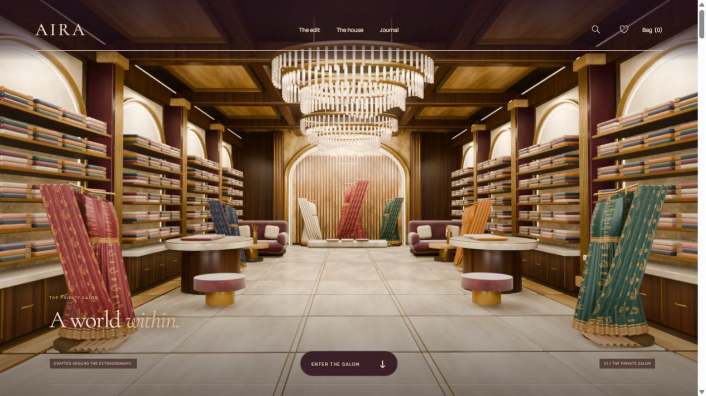

# AIRA

A complete fictional Indian fashion boutique with a scroll-controlled showroom opening and a warm parchment, espresso and terracotta editorial identity. Built with Next.js, React, TypeScript and GSAP.

## Showroom rebuild — October 7, 2026

The actual showroom is rebuilt from a new Blender scene, with richer architecture, bespoke furniture, 720 folded sarees, seven individual pleated drapes with diagonal pallus and woven paisley borders, and warm architectural lighting. It has no people, mannequins or photographic cutouts. The room is shown immediately, without the previous silk curtain overlay. A forward/reverse camera journey leads into the private bridal salon and finishes close to the crimson saree's zari detail. Desktop and phone films have independent camera projections and matching still fallbacks. See `SHOWROOM-V9.md`.



A continuous-thread illustration leads into the interactive six-mood atelier. Selecting a mood changes its palette, portrait, detail crop, title, description and shop link. The selector supports touch and keyboard arrows/Home/End, with crossfades disabled for reduced motion. The product edit, textile study, campaign and journal follow. The established catalogue photography remains outside the showroom.

## Run

```sh
npm install
npm run dev -- --port 3001
```

Production:

```sh
npm run typecheck
npm run build
npm run start -- --port 3001
```

## Experience

Ivory salon-invitation loading screen → immersive showroom → curved paper transition → staggered Six Moods → curated products → house perspective → campaign → journal → personal styling → complete footer.

The showroom is a completely rebuilt walnut, brass, crystal and silk interior with a 5.8m coffered ceiling, illuminated arched display alcoves, garnet stone pilasters, bookmatched marble, oval consultation tables, velvet seating and a monumental bridal arch. All saree displays are modelled fabric. There are no people, mannequins, photographic cutouts or portrait textures in the new scene.

The scene is authored in Blender and rendered offline. Scroll seeks forward or backward through its camera film. The phone film is rendered with a separate portrait projection. The opening presents the actual interior directly, without curtain overlays or colour filters. See `SHOWROOM-V9.md` for the architecture, source and delivery details.

A smaller portrait film serves mobile/data-saver/slow connections. Reduced motion displays the still without downloading a film. Loading tracks actual bytes and decoded readiness; timeouts reveal a usable still. A single decoded seek processes the latest target. Native collection scrolling supports touch, arrow controls and keyboard navigation without trapping vertical scrolling. Product/editorial images use responsive Next.js image optimization; fonts are self-hosted through next/font.

## Complete routes

- `/` — showroom and full editorial homepage.
- `/shop` — search, collection/new/saved filters, price/name sorting and empty states.
- `/products/[slug]` — six complete details pages, quantity, save, add and care notes.
- `/saved` — persistent personal moodboard.
- `/bag` — persistent quantities, removal, totals and empty state.
- `/checkout` — validated local demonstration and selection-summary confirmation.
- `/story` — brand perspective.
- `/journal` and three article routes — complete reading experiences.
- `/visit` — validated local styling preview and clear-saved-details control.
- `/help` — anchored delivery, returns, care and contact FAQs.
- Unknown products/articles/pages — branded not-found experience.

Shared search uses actual catalogue data. Native dialogs support Escape, focus containment and closing. All header/footer destinations resolve to implemented pages.

## Preview boundaries

AIRA is fictional. Product names, prices, composition and dimensions are illustrative. Supplied campaign photos express each mood; the generated textile study is an editorial illustration. Checkout takes no payment, places no real order and sends nothing. It saves only the selection summary, discarding submitted personal details. Styling saves sample details locally and books no appointment; its clear button removes them. Cart and saved pieces use validated browser storage with in-memory fallback.

Real inventory, prices, shipping/returns policies, a business contact, payment provider and a booking service must be supplied and connected before commercial launch.

## Source and assets

Main composition: `src/components/OpeningExperience.tsx`, `src/styles/aira.css`.
Player: `src/components/StoreJourney.tsx`, `StoreJourney.module.css`.
Commerce: `src/components/shop/`, `src/lib/products.ts`, `src/styles/shop.css`.
Editorial pages and articles: `src/app/`, `src/lib/journal.ts`, `src/styles/editorial.css`.

Latest media: `public/video/aira-store-v9.mp4`, `public/video/aira-store-mobile-v9.mp4`, `public/images/store-poster-v9.jpg`.
Packed editable scene: `artwork/aira-store-v9.blend`.
Original generated silk image: `artwork/editorial/aira-silk-study-v1.png`; web version: `public/images/editorial-silk.webp`.
See `EDITORIAL-ASSETS.md` for the exact built-in image-generation prompt and `SHOWROOM-V9.md` for the new scene and `MODEL-ASSETS.md` for historical figure experiments. Earlier visual experiments are retained as source history and are not imported by the current homepage.
## Current delivery

V9 has 84 native camera views per film (12fps), repeated twice in a 24fps container. Both films use frequent keyframes and fast-start encoding for paused seeking. The player paints the first decoded frame before revealing the showroom. The packed scene contains no photographic image assets.

The established catalogue, journal, bag, local checkout and styling routes remain implemented. Historical showroom films, posters and generated human cutouts are archived outside public delivery under `artwork/history/display-assets/`.

Current render, encoding and verification records are in `.preview/store-v9/`. See `SHOWROOM-V9.md`.
